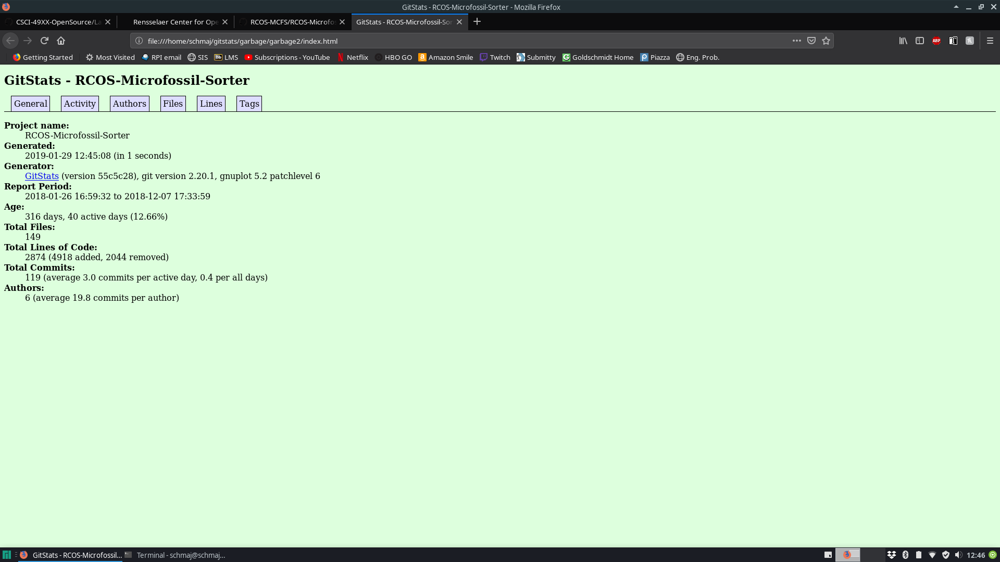
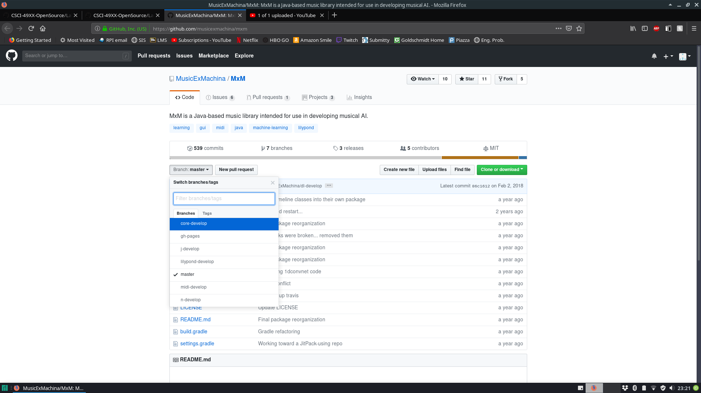
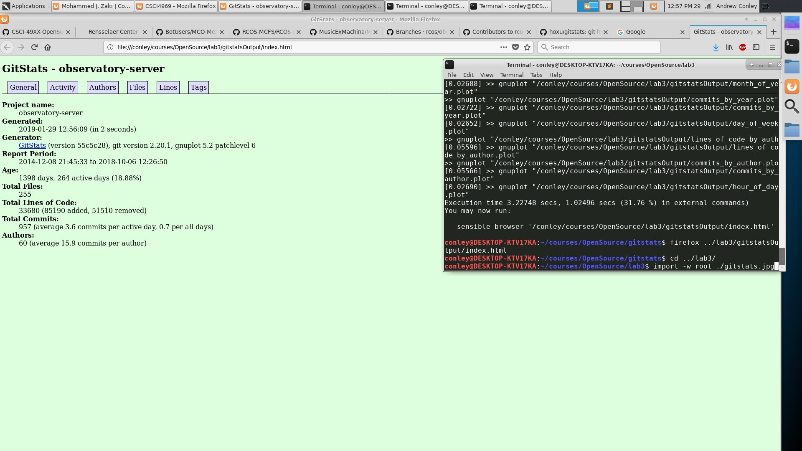
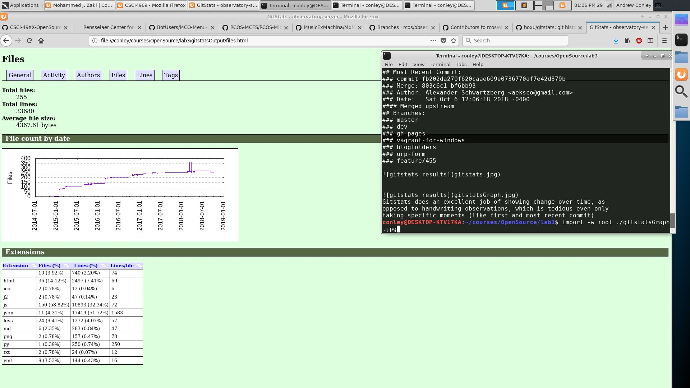
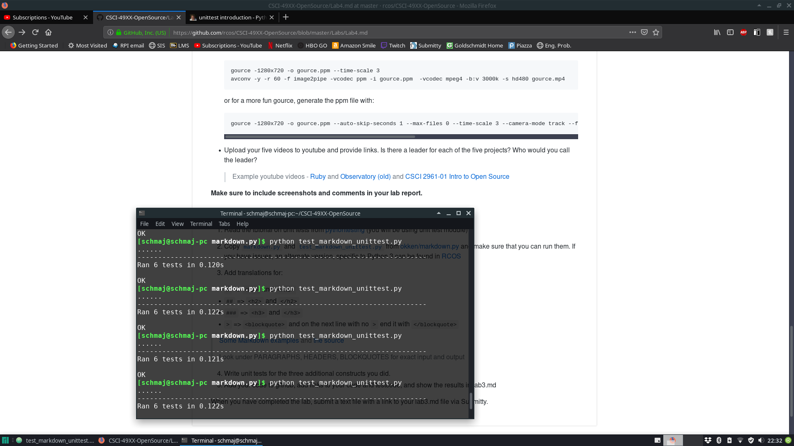

RCOS-MicrofossilSorter
- Number of contributors: 3
- Number of lines of code: 109076
- Initial commit: "Initial Commit", Fri Jan 26 16:59:32 2018 -0500
- Latest Commit: "half approach.py function documented", Fri Dec 7 17:33:59 2018 -0500
- Current Branches: master, WebsiteUpdate, documentation
- Compared to the above, GitStats returned less total lines of code, with 2874 lines. The number of contributors on GitHUb is half - as many authors returned by GitStats.

- Gource Video: https://www.youtube.com/watch?v=UhHALqy0crA

MCO
- contributers 3
- LOC 103388
- First: Initial commit
- Latest: template init
- branches:
	- master
	- gh-pages
- git stats
	- the total LOC found is less that wc found probably because it doesnt incluse whitespace
	- they also say 4 authors instead of the 3 github said on the top bar there may be an author with only commits in another branch
- [MCO gource](http://www.bierysbargainbarn.com/gource.mp4)
- it seems like jeremiah has the most input although 99k lines in 15 commits is kinda weird...

MxM

- Number of contributors: 5
- Number of lines of code: 39059
- Initial commit: commit 2ede95db420dde4ac846342af54236c4c2b2cb1c
Author: PatrickCelentano <dr0ideka>
Date:   Thu Sep 1 17:56:25 2016 -0400

    Initial commit
- Latest Commit: Merge: 4cae011 2a49274
Author: Jon Patsenker <jonathan@patsenker.com>
Date:   Fri Feb 2 12:50:46 2018 -0500

    Merge pull request #139 from MusicExMachina/dl-develop
    
    DL develop merge, just in case
- Current Branches: master, core-develop, gh-pages, j-develop, lilypond-develop, midi-develop, n-develop
- GitStats recorded less lines of code than the git, but more contributors.
- Gource Link: https://youtu.be/vqrAqEk9AJE

# Observatory:
## 42 contributors
## 33839 total total lines of code
## First Commit: 
### commit ac21a034bd4085bcf9b87fc44b43a558698e02cf
### Author: Aaron Gunderson <airgunde@gmail.com>
### Date:   Mon Dec 8 21:45:33 2014 -0500
#### Initial commit
## Most Recent Commit:
### commit fb202da270f620caae609e0736770af7e42d379b
### Merge: 803c6c1 bf6bb93
### Author: Alexander Schwartzberg <aeksco@gmail.com>
### Date:   Sat Oct 6 12:06:18 2018 -0400
#### Merged upstream
## Branches:
### master
### dev
### gh-pages
### vagrant-for-windows
### blogfolders
### urp-form
### feature/455

Gitstats does an excellent job of showing change over time, as
opposed to handwriting observations, which is tedious even only
taking specific moments (like first and most recent commit)

### Gource Link: https://youtu.be/qlTX1JWcjLo

2.5 
- Code Link: https://github.com/Schmaj/CSCI-49XX-OpenSource/blob/master/markdown.py
- Test Link: https://github.com/Schmaj/CSCI-49XX-OpenSource/blob/master/test_markdown_unittest.py
- Results: 
